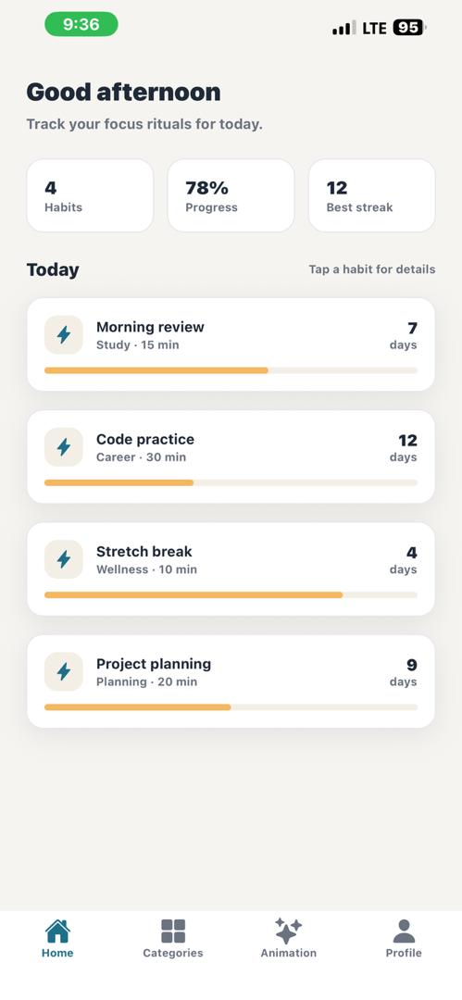
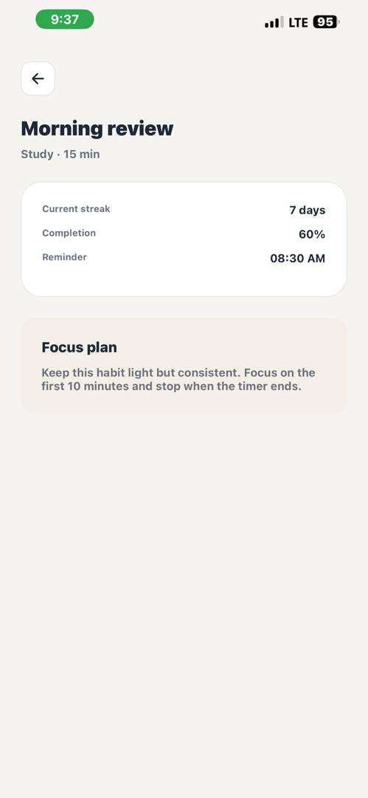
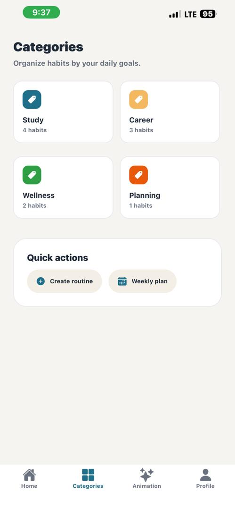
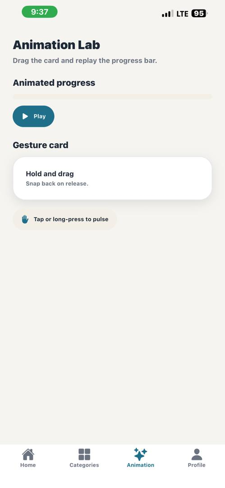
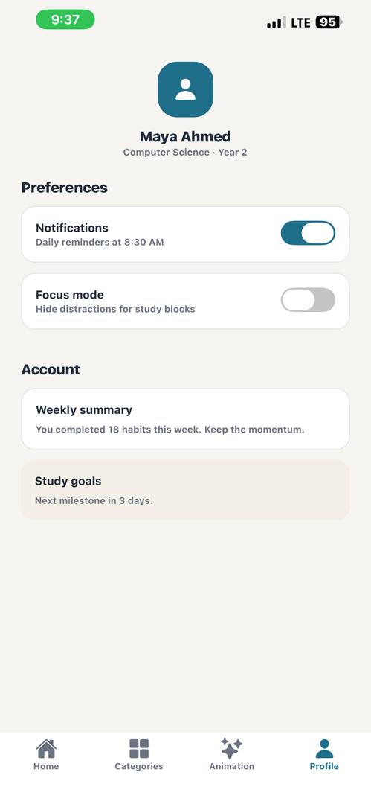

# Student Productivity App Report

## App idea
A modern habit tracker for students to plan study routines, track streaks, and stay focused without any backend.

## Key features
- Multi-screen flow with tabs and a stack detail screen.
- Home dashboard showing daily habits and progress.
- Category view to organize routines and quick actions.
- Detail screen with habit insights and guidance.
- Profile screen with settings and weekly summary.
- Animation lab screen to demonstrate gestures and animated UI.

## Navigation flow
- Root stack: Tabs -> Detail
- Bottom tabs: Home, Categories, Animation, Profile

## Animations used
- Fade and slide-in header + cards on Home.
- Detail screen content fade and slide.
- Animated progress bar on Animation screen.
- Pulse scale animation on the draggable card.

## Gestures used
- Drag gesture with snap-back on Animation screen.
- Tap or long-press to trigger pulse animation.

## Reusable components
- HabitCard component for habit summary cards.

## Screenshots
-**Home Screen**

-**Habit Details Screen**

-**Categories Screen**

-**Animation Screen**

-**Profile Screen**
